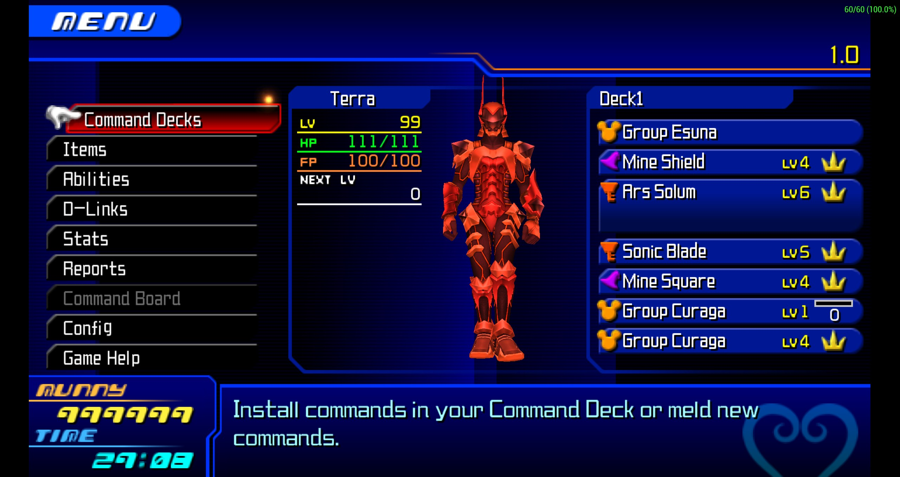

# Birth by Sleep Final Mix Superboss Mod
PSP emulator with a patch to fight superbosses.

The version of the mod can be verified by entering the Camp Menu (Start button) in
the Mirage Arena Hub and looking at the map name as in the following image:

## What this mod includes
Difficulty is based on Critical Mode with Level 70-80 saves.  
It is highly recommended to use **Group Esuna** and **Group Curaga** for all fights.

**New missions**:
| Name | Difficulty | Players | Description
------------ | ------------- | ----------- | -----------
| Light's Lessons+ | (★★★★☆) | Up to 3 players | Fight an enhanced version of Armor of Eraqus. 
| Peering intro Darkness+ | (★★★★☆) | Up to 3 players | Fight an enhanced version of No Heart. 
| Dark Menace | (★★☆☆☆) | Up to 3 players | Battle against a wave of darkness beings. 
| Disney Rush | (★★★☆☆) | Up to 3 players | Battles against supercharged Disney bosses. 
| Ultimate Duo | (★★★★★) | Up to 2 players* | Fight against No Heart and Armor of Eraqus.
| Greatest Foes | (★★★★★) | Up to 3 players | Fight against enhanced versions of some of the greatest bosses in the game. 

*This battle only works for 2 players. Adding a 3rd one will make the battle unplayable.

**Extras**:
- Normal Moogle added to the Mirage Arena to be able to buy regular commands without exiting the world.

# --How to use--
First you need to apply the patch to your ISO.  
In order to check if your ISO is patchable, check if the following MD5 checksum matches your ISO.  
A recommended tool to check MD5 checksum is in this website: https://www.winmd5.com/

> MD5 checksum Clean ISO:
> f03e65561e17231c7510d51a30927ecd

Now, just use xDeltaUI included to this repository to patch your ISO. xdelta.exe is required to run xdeltaUI.exe.

Here's the download link to the patch itself in two different links:  
https://drive.google.com/file/d/14b9s3bzcuNL35kkf4nv0JOMuAmTM0bWx/view?usp=sharing
https://mega.nz/file/nGwknD6D#LPkgibBct0Hg0HQcIqFukv_KdJoKfZd9LLneS8zv0dI

# Common issues
Greatest foes:
- First round boss can have disappearing effects on clients.

Dark Menace:
- Final round boss can cause crashes at random or have disappearing effects on clients.

- While 3 slots commands can be used, be wary that they can cause random crashes due to extra RAM being used.

- Network desynchronizations can end up in bosses behaving incorrectly (sometimes making them harder because of it).

- During Ultimate Duo, No Heart can take a while to begin moving.

# Testers
Huge thank you to the following people who helped test the mod:
- [Meebo](https://twitter.com/Sora3100)
- [Zakilj3](https://twitter.com/Zakilj3)
- [Cyberman](https://twitter.com/Cyberman6)
- [13th Vessel](https://twitter.com/ligero_miguel)
- [Bio-Roxas](https://twitter.com/Bio_Roxas)
- [KZ](https://twitter.com/KZXcellent)

# Contributions
If you want to help me keep making things like this, please consider donating:  
[Donation link](http://paypal.me/keytotruth)
